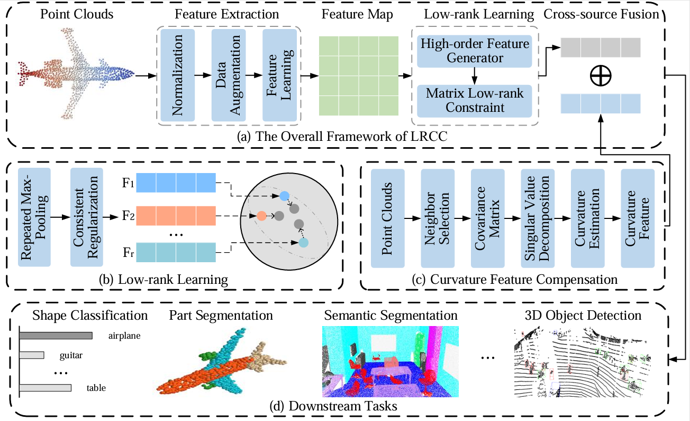

# LRCC: Robust point cloud understanding via Low-rank Refinement and Curvature Compensation

This is a pytorch implementation of the paper: *LRCC: Robust point cloud understanding via Low-rank Refinement and Curvature Compensation.*
**The code for ScanObjectNN, ModelNet10 and ModelNet40 dataset experiment has been given.**

## Low-rank Refinement and Curvature Compersation
The overall framework of the proposed LRCC is shown in the picture below. It consists of a high-order feature generator, a low-rank learner, a curvature compensator, and a cross-source feature fusion module. First, the high-order feature generator is designed to decompose the feature map into multi-granularity representations. Second, the low-rank learner constrains the learned features to provide a more consistent representation. Then, the curvature compensator serves as an additional feature patch to mitigate information loss induced by the low-rank learning strategy. Finally, we concatenate both low-rank and curvature features for downstream tasks.


## Installation

* The code has been tested on one configuration:
    - Python 3.8
    - PyTorch 2.1.0
    - CUDA 11.1

* Install required packages:
    - numpy
    - h5py
    - scikit-learn
    - matplotlib

## Point Cloud Classification on ModelNet40
You can download the [official data](https://shapenet.cs.stanford.edu/media/modelnet40_ply_hdf5_2048.zip), and unzip it. 

## Point Cloud Classification on ScanObjectNN
You can download the [official data](https://hkust-vgd.github.io/scanobjectnn/). 

### Train
Training the original PointNet on the ModelNet dataset
```
python Baseline/train_pointcloud_cls.py --data_root /path/to/Data --num_class 10 or 40
```

Training the original PointNet on the ScanObjectNN dataset
```
python Baseline/train_pointcloud_cls_scanobject.py --data_root /path/to/Data --num_class 15
```

Training the original PointNet with LR (Low Rank) module on the ModelNet dataset
```
python LR/train_pointcloud_cls.py --data_root /path/to/Data --num_class 10 or 40 --refine_time 3
```

Training the original PointNet with LR (Low Rank) module on the ScanObjectNN dataset
```
python LR/train_pointcloud_cls_scanobject.py --data_root /path/to/Data --num_class 15 --refine_time 3
```

Training the original PointNet with CC (Curvature Compensator) module on the ModelNet dataset
```
python CC/train_pointcloud_cls.py --data_root /path/to/Data --num_class 10 or 40
```

Training the original PointNet with CC (Curvature Compensator) module on the ScanObjectNN dataset
```
python CC/train_pointcloud_cls_scanobject.py --data_root /path/to/Data --num_class 15
```

## Citation
Please cite this paper if you want to use it in your work.

	@article{LRCC,
	  title={LRCC: Robust point cloud understanding via Low-rank Refinement and Curvature Compensation},
	  author={Zhuang, Chen and Ye, Su and Xiao, Jiang and Lili, Li and Chuwei, Jin and Yichen, Ye and Yiyuan, Xie},
	  journal={Preprint submitted to Pattern Recognition},
	  year={2026}
	}

## Acknowledgement
The structure of this codebase is borrowed from [PointNet](https://github.com/charlesq34/pointnet) and [Recycle_Maxpooling_Module](https://github.com/jiajingchen113322/Recycle_Maxpooling_Module/tree/master).

